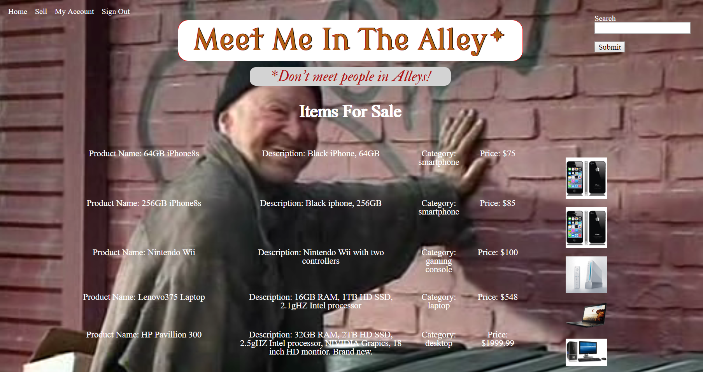

#
<h1>

Meet Me In The Alley

</h1>

### Meet Me In The Alley is a full stack website built with HTML, CSS, SASS, jQuery, NodeJS, ExpressJS, HandlebarsJS, & MySQL.  Users are able to buy and sell items using our intuitive online marketplace.

---
[CLICK ME to see it in action](https://ancient-retreat-52295.herokuapp.com/)
  

---
 

  

This Project was developed and is maintained by the Brogrammers Team, to get help contact

- Daniel Olivas (me@danielolivas.net, danielolivas.net)
- Erick Bsilvall (github: bsilvall)
- Andrew Nowlin (github: AndewNowlin)

